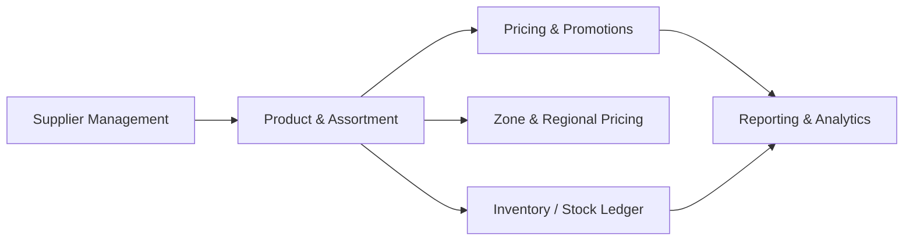

# Domain Map

## Domain-to-system matrix

| Domain | RMS | RPM | Primary data owner | Candidate target bounded context |
|---|---:|---:|---|---|
| Product Master Data | Yes | Consumes | RMS | Product Catalogue |
| Supplier Management | Yes | No | RMS | Supplier Management |
| Assortment / Ranging | Yes | Consumes | RMS / BY SRD | Assortment Management |
| Regular Pricing | Consumes | Yes | RPM | Pricing |
| Promotions | Consumes | Yes | RPM | Promotions |
| Zone Pricing | Consumes | Yes | RPM | Price Zones |
| Stock Ledger | Yes | No | RMS | Inventory Ledger / Reporting |

## Mermaid domain relationship diagram

## AI modernization notes

- `Product & Assortment` should be understood before `Pricing & Promotions` because RPM depends on item and location context from RMS.
- `Pricing & Promotions` can be a thin-slice candidate if price event workflow has clear boundaries and manageable integration dependencies.
