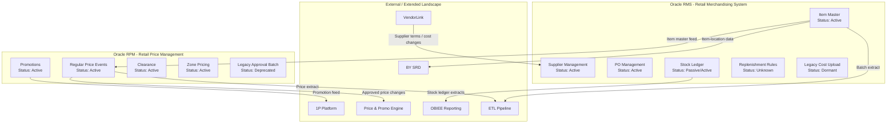

# High-Level Used + Unused Module Block Diagram

## Purpose

Show the module-level delivery posture for Lotus legacy systems, distinguishing active capability from reference-only and candidate decommissioning scope.

This diagram is intended to support prioritization and thin-slice selection by highlighting the areas of the landscape that are:
- actively used and modernization-critical
- passive or read-only
- dormant or obsolete
- unknown and in discovery risk

## Legend

| Status | Meaning |
|---|---|
| Active | Current business/runtime usage identified |
| Passive | Reference or reporting usage only |
| Dormant | Exists but no recent usage evidence |
| Deprecated | Confirmed retired or replaced |
| Unknown | Requires validation and discovery |

## Mermaid diagram

## Interpretation

- `RMS_ITEM` and `RPM_PRICE` are core seams for modernization, with active usage and strong downstream dependencies.
- `RMS_LEGACY_COST` and `RPM_OLD_APPROVAL` are likely decommissioning candidates, unless evidence proves they are still required.
- `RMS_REPL` is a discovery-risk area; validate its current business role before including it in a modernization slice.
