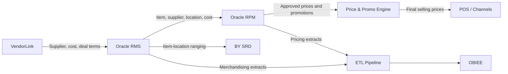

# System Dependency Map

## Dependency observations

| Dependency | Coupling | Modernization concern |
|---|---|---|
| RMS → RPM item/cost feed | High | Pricing cannot be safely modernized without stable product master contract. |
| RPM → Price & Promo Engine | Medium/High | Price publication contract must be documented before replacement. |
| RMS/RPM → ETL/OBIEE | Medium | Reporting dependencies may keep legacy tables alive after functional migration. |
