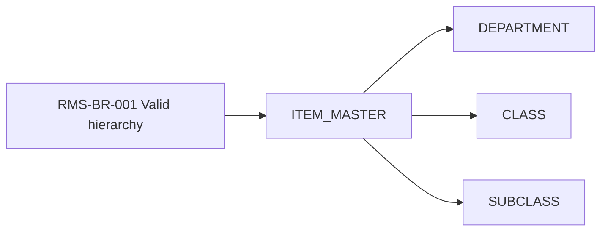

## Purpose

Capture Oracle RMS capability, screen and business rule traceability in one document to support functional analysis and target context mapping.

# Capability and Behaviour — Oracle RMS

## Capability Map

| Capability ID | L0 Domain | L1 Capability | L2 Functional Capability | Actor | Trigger | Outcome | Screens | APIs / Jobs | Tables | Status | Confidence |
|---|---|---|---|---|---|---|---|---|---|---|---|
| RMS-CAP-001 | Product & Assortment | Product Master Data | Create item | Merchandising user | UI create / upload | Item created in approved/pending state | `ITEM_MAINT` | `ITEM_CREATE_PROC` | `ITEM_MASTER` | Active | Medium |
| RMS-CAP-002 | Product & Assortment | Product Master Data | Maintain item attributes | Merchandising user | UI update | Item attributes updated and published | `ITEM_MAINT` | `ITEM_UPDATE_PROC` | `ITEM_MASTER`, `ITEM_ATTR` | Active | Medium |
| RMS-CAP-003 | Supplier Management | Supplier Setup | Maintain supplier | Supplier Ops | UI / VendorLink | Supplier available for item sourcing | `SUPPLIER_MAINT` | `SUP_SYNC_JOB` | `SUPPLIER` | Active | Medium |
| RMS-CAP-004 | Product & Assortment | Cost Management | Maintain item-supplier cost | Buying / Supplier Ops | UI / integration | Cost available for price/margin calculation | `ITEM_SUPPLIER_COST` | `COST_SYNC_JOB` | `ITEM_SUPPLIER` | Active | Medium |
| RMS-CAP-005 | Procurement | Purchase Order | Create PO | Buyer | UI / replenishment | PO created and sent downstream | `PO_MAINT` | `PO_CREATE_PROC` | `PURCHASE_ORDER`, `PO_LINE` | Active | Medium |
| RMS-CAP-006 | Inventory Ledger | Stock Ledger | Generate stock ledger movement | Batch | Inventory events | Ledger records available for finance/reporting | N/A | `STOCK_LEDGER_POST_JOB` | `STOCK_LEDGER` | Passive/Active | Low |

## Screen-to-Capability Map

| Screen ID | Screen Name | User Role | Capability | Actions | Validations | Tables/API Used | Usage Status | Evidence |
|---|---|---|---|---|---|---|---|---|
| `ITEM_MAINT` | Item Maintenance | Merchandising User | Maintain Item Master | Create, edit, submit, approve | Mandatory dept/class, valid supplier, status transition | `ITEM_MASTER`, `ITEM_ATTR`, `ITEM_UPDATE_PROC` | Active | Screenshot pending, code route pending |
| `SUPPLIER_MAINT` | Supplier Maintenance | Supplier Ops | Maintain Supplier | Create, update, deactivate | Supplier unique, tax details, active status | `SUPPLIER`, `SUPPLIER_SITE` | Active | SME pending |
| `ITEM_SUPPLIER_COST` | Item Supplier Cost | Buying | Maintain item cost | Update cost, effective date | New cost effective date must not overlap | `ITEM_SUPPLIER`, `COST_CHANGE` | Active | Logs pending |
| `PO_MAINT` | Purchase Order Maintenance | Buyer | Create PO | Create, amend, approve, cancel | Supplier active, item orderable, qty > 0 | `PURCHASE_ORDER`, `PO_LINE` | Active | SME pending |
| `LEGACY_COST_UPLOAD` | Legacy Cost Upload | Support | Upload cost file | Upload, validate, post | File format, supplier match | `COST_UPLOAD_STG` | Dormant | Runtime pending |

## Business Rules Catalogue

| Rule ID | Rule Statement | Capability | Rule Type | Source Evidence | Configurable? | Impact if Wrong | Validated By | Confidence |
|---|---|---|---|---|---|---|---|---|
| RMS-BR-001 | Item must belong to a valid department, class and subclass before approval. | Maintain Item Master | Validation | Code/DB lookup inferred | Partly | High | Pending | Low |
| RMS-BR-002 | Item cannot be ranged to a location unless item status is approved. | Item-location ranging | Eligibility | Code inferred | No | High | Pending | Low |
| RMS-BR-003 | Supplier must be active before it can be assigned as primary supplier for an item. | Item supplier setup | Validation | DB/code inferred | No | High | Pending | Low |
| RMS-BR-004 | New item-supplier cost cannot overlap with an existing effective-dated cost record. | Cost management | Validation | Table pattern inferred | No | High | Pending | Low |
| RMS-BR-005 | Purchase order line quantity must be greater than zero and item must be orderable. | PO management | Validation | Screen/code inferred | No | Medium | Pending | Low |

## Rule-to-data trace

