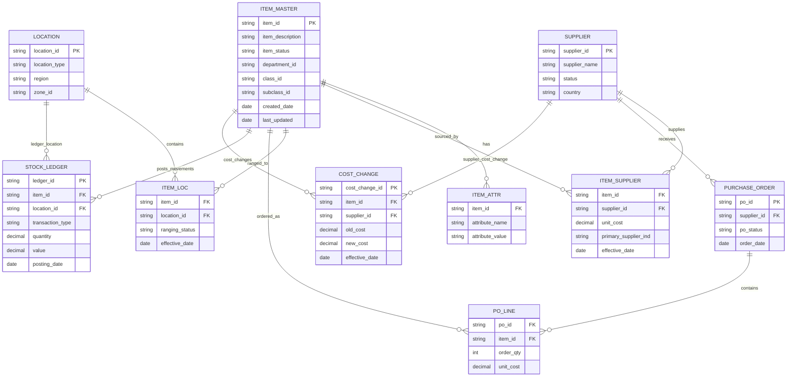

## Purpose

Capture Oracle RMS data ownership and entity relationships in a single data-model document to support migration planning and domain modeling.

# Data Model — Oracle RMS

## Data Ownership Matrix

> Row counts are example values only. Replace with production-safe query outputs from read-only DB access.

| Entity | Physical Tables | System of Record | Create | Read | Update | Delete | Consuming Systems | Example Row Count | Growth / Change Rate | Sensitivity | Notes |
|---|---|---|---|---|---|---|---|---:|---|---|---|
| Item | `ITEM_MASTER`, `ITEM_ATTR` | RMS | RMS UI / upload | RPM, BY SRD, ETL, OBIEE | RMS | Restricted | RPM, BY SRD, ETL | 2,450,000 | Medium | Core product entity |
| Supplier | `SUPPLIER`, `SUPPLIER_SITE` | RMS | RMS / VendorLink | RMS, ReIM, OBIEE | RMS / VendorLink | Restricted | ReIM, ETL | 85,000 | Low | Supplier master |
| Item Supplier | `ITEM_SUPPLIER` | RMS | RMS / VendorLink | RPM, RMS, ETL | RMS | Restricted | RPM | 6,800,000 | Medium | Cost and sourcing relationship |
| Location | `LOCATION`, `STORE`, `WAREHOUSE` | RMS | RMS | RPM, BY SRD, ETL | RMS | Restricted | RPM, BY SRD | 4,500 | Low | Store/warehouse/location master |
| Purchase Order | `PURCHASE_ORDER`, `PO_LINE` | RMS | RMS | ReIM, ETL | RMS | Restricted | ReIM | 12,200,000 | High | Transactional |
| Stock Ledger | `STOCK_LEDGER` | RMS | Batch | OBIEE, ETL | Batch | Archive only | OBIEE | 980,000,000 | Very High | Reporting/finance critical |

## SQL evidence pattern

```sql
-- Example safe row-count query pattern
SELECT 'ITEM_MASTER' AS table_name, COUNT(*) AS row_count FROM RMS.ITEM_MASTER;
```

## ER Diagram

# ER Diagram — Oracle RMS Product & Merchandising Core



## AI modernization interpretation

- `ITEM_MASTER` is a candidate aggregate root for a Product Catalogue context.
- `ITEM_SUPPLIER` may belong either in Product Catalogue or Supplier Costing depending on ownership rules.
- `STOCK_LEDGER` is high-volume and should usually not be moved as part of the first thin slice unless required.
