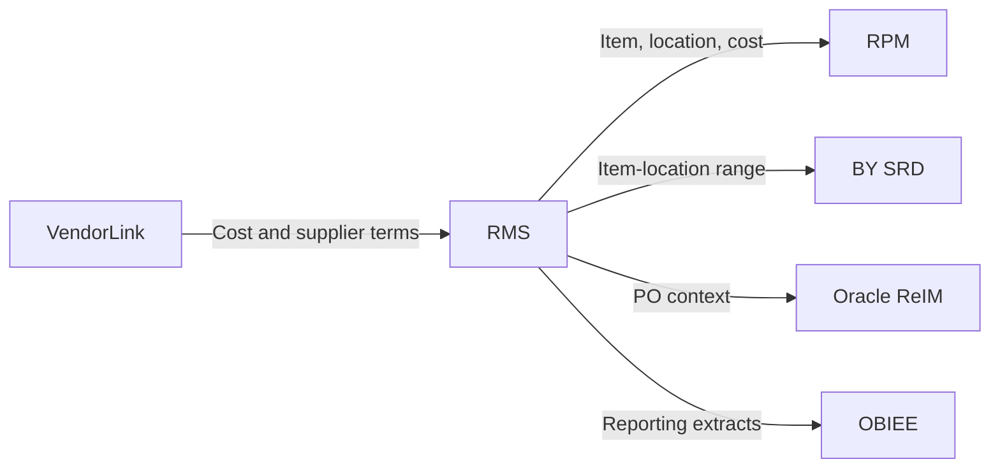
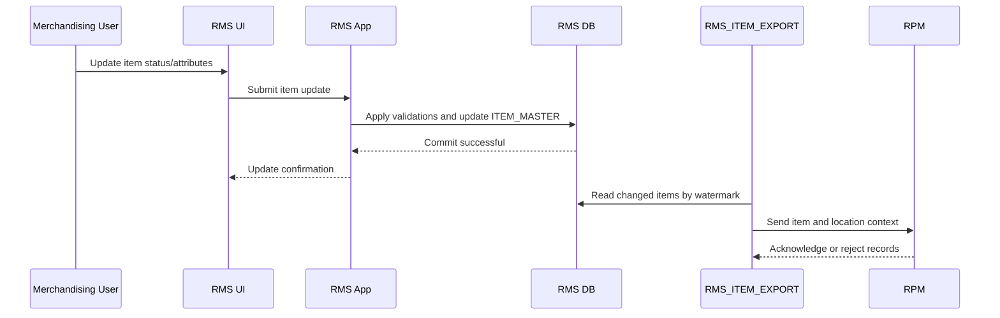

## Purpose

Document Oracle RMS integration contracts, legacy endpoints, and runtime jobs/execution flows in one consolidated runtime document.

# Integration and Execution — Oracle RMS

## Integration Catalogue

| Integration ID | Source | Target | Type | Direction | Capability | Data / Payload | Frequency | Protocol | Owner | Failure Handling | Status | Complexity |
|---|---|---|---|---|---|---|---|---|---|---|---|---|
| RMS-INT-001 | VendorLink | RMS | API / batch | Inbound | Supplier cost maintenance | Supplier, item, cost, deal terms | Daily / event-like | API via middleware | Supplier Platform | Retry + error report | Active | Medium |
| RMS-INT-002 | RMS | RPM | Batch/API/event | Outbound | Product data for pricing | Item, location, cost, status | Near real-time / scheduled | Oracle SOA | RMS/RPM | Retry queue | Active | High |
| RMS-INT-003 | RMS | BY SRD | Batch/API | Outbound | Assortment and item-location ranging | Item, location, ranging status | Daily | Oracle SOA | Merchandising | Batch rerun | Active | Medium |
| RMS-INT-004 | RMS | ReIM | Batch/API | Outbound | Purchase order and receipt context | PO header/line, supplier | Daily | Oracle SOA | Buying/AP | Reconciliation report | Active | Medium |
| RMS-INT-005 | RMS | OBIEE | DB/ETL | Outbound | Reporting | Item, supplier, stock ledger | Nightly | ETL/direct read | Reporting | ETL rerun | Active | High |

## Integration dependency diagram

## Endpoint / Service Catalogue

> For legacy systems, endpoints may be REST, SOAP, SOA services, stored procedures, batch interfaces or UI actions. This catalogue normalizes them for modernization planning.

| Endpoint / Interface | Type | Capability | Request/Input | Response/Output | Tables touched | Dependencies | Status | Complexity |
|---|---|---|---|---|---|---|---|---|
| `ITEM_CREATE_PROC` | Stored procedure | Create item | Item attributes, dept/class, supplier | Item ID/status | `ITEM_MASTER`, `ITEM_ATTR` | Supplier, dept/class lookup | Active | High |
| `ITEM_UPDATE_PROC` | Stored procedure | Update item | Item ID + changes | Update status/result | `ITEM_MASTER`, `ITEM_ATTR` | Status rules | Active | High |
| `RMS_ITEM_EXPORT` | Batch extract | Publish item data | Changed item set | Item feed file/message | `ITEM_MASTER`, `ITEM_LOC` | RPM, BY SRD | Active | High |
| `COST_SYNC_JOB` | Batch/API | Supplier cost update | VendorLink cost change | Cost updated/rejected | `ITEM_SUPPLIER`, `COST_CHANGE` | VendorLink | Active | Medium |

## Jobs and Execution Flows

### Job catalogue

| Job ID | Job Name | Schedule | Trigger | Input | Processing Logic | Output | Dependencies | Failure / Retry | Last Run | Status |
|---|---|---|---|---|---|---|---|---|---|---|
| RMS-JOB-001 | `RMS_ITEM_EXPORT` | Hourly / nightly | Changed items | `ITEM_MASTER`, `ITEM_LOC` | Extract changed items and locations | Item feed to RPM/BY SRD | RMS DB, SOA | Retry from watermark | Sample current | Active |
| RMS-JOB-002 | `STOCK_LEDGER_POST_JOB` | Nightly | Inventory transactions | Inventory movement tables | Post ledger entries | `STOCK_LEDGER` | Inventory feeds | Batch rerun | Sample current | Active |
| RMS-JOB-003 | `COST_SYNC_JOB` | Daily | VendorLink feed | Cost changes | Validate and update costs | `ITEM_SUPPLIER`, exception report | VendorLink | Error report + replay | Sample current | Active |
| RMS-JOB-004 | `LEGACY_COST_UPLOAD_JOB` | Manual | File upload | CSV file | Validate and stage cost changes | `COST_UPLOAD_STG` | Manual file | Manual correction | Unknown | Dormant |

### Item update execution flow

## Modernization note

`RMS_ITEM_EXPORT` is a strong coexistence seam. A target Product Catalogue service could initially publish the same contract while RMS remains system of record.
