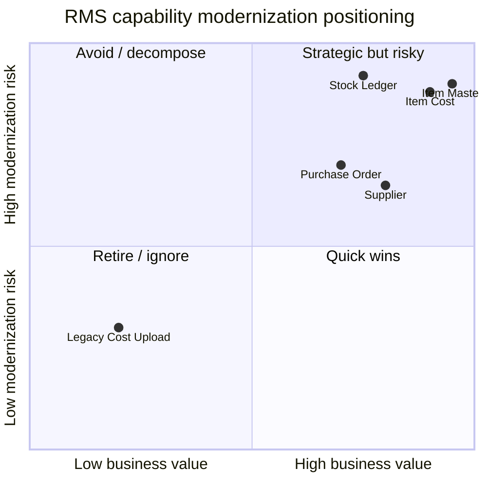
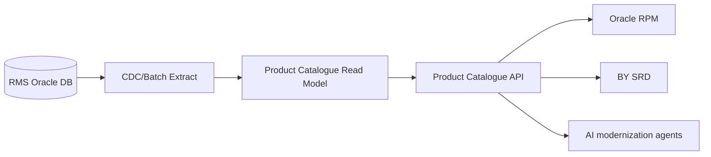

## Purpose

Combine Oracle RMS complexity assessment, thin-slice recommendations and open questions into a single modernization summary document.

# Modernization Summary — Oracle RMS

## Complexity Heatmap

Scoring: 1 = low, 5 = high.

| Capability | Business Criticality | Usage | Code Complexity | Data Complexity | Integration Coupling | Rule Complexity | Change Risk | Modernization Difficulty | Score | Recommendation |
|---|---:|---|---|---|---|---|---|---:|---:|---|
| Maintain Item Master | 5 | 5 | 4 | 5 | 5 | 4 | 5 | 5 | 38 | Deep analysis and gradual strangler |
| Maintain Supplier | 5 | 4 | 3 | 4 | 3 | 3 | 4 | 4 | 30 | Candidate after item context understood |
| Maintain Item Cost | 5 | 4 | 4 | 4 | 4 | 5 | 5 | 5 | 36 | High-risk due to margin/pricing impact |
| Purchase Order | 4 | 4 | 3 | 4 | 4 | 3 | 4 | 4 | 30 | Defer until ReIM dependency mapped |
| Stock Ledger | 4 | 5 | 5 | 5 | 4 | 3 | 5 | 5 | 36 | Avoid as first slice unless reporting requires |
| Legacy Cost Upload | 2 | 1 | 3 | 2 | 1 | 2 | 2 | 2 | 15 | Candidate retirement |

## Mermaid heatmap view

## Thin-Slice Recommendations

### Candidate 1: Product Catalogue Read API

| Factor | Assessment |
|---|---|
| Capability | Expose item master read model from RMS |
| Business value | High — enables downstream modernization without immediately replacing RMS writes |
| Technical feasibility | Medium |
| Data migration complexity | Low/Medium if read-only projection is used |
| Integration complexity | Medium — RPM, BY SRD and reporting consumers |
| Risk | Controlled if built as read-only anti-corruption layer |
| Recommendation | Proceed as first RMS-adjacent thin slice |

#### Current-state evidence

- Tables: `ITEM_MASTER`, `ITEM_ATTR`, `ITEM_LOC`, `ITEM_SUPPLIER`
- Jobs: `RMS_ITEM_EXPORT`
- Consumers: RPM, BY SRD, ETL

#### Target-state hypothesis

### Candidate 2: Retire Legacy Cost Upload

| Factor | Assessment |
|---|---|
| Capability | Legacy manual cost upload |
| Business value | Medium if support burden exists |
| Technical feasibility | High if dormant confirmed |
| Risk | Low/Medium; must validate exception usage |
| Recommendation | Validate and retire, do not modernize like-for-like |

### Candidate 3: Item Cost Change Service

| Factor | Assessment |
|---|---|
| Capability | Maintain item-supplier cost changes |
| Business value | Very High |
| Risk | High due to pricing/margin impact |
| Recommendation | Defer until business rules and RPM dependency are fully validated |

## Open Questions

| ID | Question | Owner | Priority | Needed for |
|---|---|---|---|---|
| RMS-Q-001 | Which RMS item screens are actively used by merchandising users? | Business SME | High | Used/unused classification |
| RMS-Q-002 | Are item updates published to RPM in real time, batch, or both? | Technical SME | High | Integration strategy |
| RMS-Q-003 | Is stock ledger required in target modernization scope or only reporting continuity? | Finance SME | High | Scope boundary |
| RMS-Q-004 | Is legacy cost upload still used for exceptions? | Support SME | Medium | Retirement decision |
| RMS-Q-005 | Which item attributes are mandatory for pricing eligibility? | Merchandising/RPM SME | High | Product-pricing contract |
