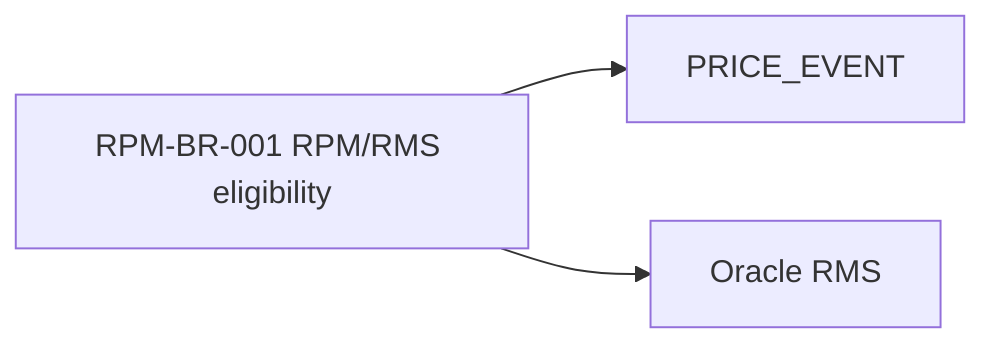

## Purpose

Capture Oracle RPM capability, screen and business rule traceability in one document to support functional analysis and target context mapping.

# Capability and Behaviour — Oracle RPM

## Capability Map

| Capability ID | L0 Domain | L1 Capability | L2 Functional Capability | Actor | Trigger | Outcome | Screens | APIs / Jobs | Tables | Status | Confidence |
|---|---|---|---|---|---|---|---|---|---|---|---|
| RPM-CAP-001 | Pricing & Promotions | Regular Pricing | Create price event | Pricing user | UI create | Price event in draft/pending status | `PRICE_EVENT_MAINT` | `PRICE_EVENT_SAVE_PROC` | `PRICE_EVENT`, `PRICE_EVENT_ITEM` | Active | Medium |
| RPM-CAP-002 | Pricing & Promotions | Regular Pricing | Approve price event | Pricing manager | Approval action | Approved price event ready for publish | `PRICE_APPROVAL` | `PRICE_APPROVE_PROC` | `PRICE_APPROVAL` | Active | Medium |
| RPM-CAP-003 | Pricing & Promotions | Promotions | Create promotion | Promotions user | UI/API | Promotion created | `PROMO_MAINT` | `PROMO_SAVE_PROC` | `PROMOTION`, `PROMO_COMPONENT` | Active | Medium |
| RPM-CAP-004 | Pricing & Promotions | Promotions | Publish promotion | Batch | Schedule/effective date | Promotion available downstream | N/A | `PROMO_PUBLISH_JOB` | `PROMOTION` | Active | Medium |
| RPM-CAP-005 | Zone & Regional Pricing | Price Zones | Maintain zone-location mapping | Pricing ops | UI/batch | Zone mapping available for pricing | `ZONE_MAINT` | `ZONE_UPDATE_PROC` | `PRICE_ZONE`, `ZONE_LOCATION` | Active | Medium |

## Screen-to-Capability Map

| Screen ID | Screen Name | User Role | Capability | Actions | Validations | Tables/API Used | Usage Status | Evidence |
|---|---|---|---|---|---|---|---|---|
| `PRICE_EVENT_MAINT` | Price Event Maintenance | Pricing user | Create/update price event | Create, edit, submit | Item eligible, zone valid, effective date valid | `PRICE_EVENT`, `PRICE_EVENT_ITEM` | Active | Screenshot pending |
| `PRICE_APPROVAL` | Price Approval | Pricing manager | Approve price event | Approve, reject, return | Approval threshold, status transition | `PRICE_APPROVAL` | Active | SME pending |
| `PROMO_MAINT` | Promotion Maintenance | Promotions user | Create promotion | Create, update, schedule | Valid promotion components, overlap rules | `PROMOTION`, `PROMO_COMPONENT` | Active | SME pending |
| `ZONE_MAINT` | Zone Maintenance | Pricing ops | Maintain zones | Create, update, map locations | Valid zone/location mapping | `PRICE_ZONE`, `ZONE_LOCATION` | Active | SME pending |

## Business Rules Catalogue

| Rule ID | Rule Statement | Capability | Rule Type | Source Evidence | Configurable? | Impact if Wrong | Validated By | Confidence |
|---|---|---|---|---|---|---|---|---|
| RPM-BR-001 | A price event cannot be approved if the item is not active in RMS. | Price event approval | Eligibility | Inferred from RMS dependency | No | High | Pending | Low |
| RPM-BR-002 | Price event effective date must be today or future date at creation time. | Price event creation | Validation | Screen/code inferred | Partly | Medium | Pending | Low |
| RPM-BR-003 | Promotion overlap must be resolved before publish. | Promotion publish | Validation | Business rule inference | Partly | High | Pending | Low |
| RPM-BR-004 | Clearance events require valid zone and effective date. | Clearance activation | Validation | Screen/code inferred | No | Medium | Pending | Low |

## Rule-to-data trace

