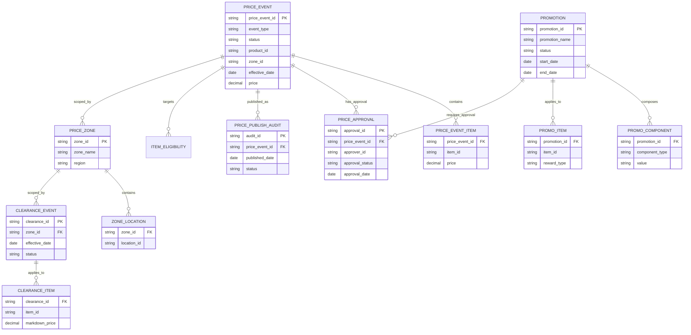

## Purpose

Capture Oracle RPM data ownership and entity relationships in a single data-model document to support migration planning and domain modeling.

# Data Model — Oracle RPM

## Data Ownership Matrix

> Row counts are example values only. Replace with production-safe query outputs from read-only DB access.

| Entity | Physical Tables | System of Record | Create | Read | Update | Delete | Consuming Systems | Example Row Count | Growth / Change Rate | Sensitivity | Notes |
|---|---|---|---|---|---|---|---|---:|---|---|---|
| Price Event | `PRICE_EVENT`, `PRICE_EVENT_ITEM` | RPM | RPM UI/API | Price Engine, ETL | RPM | Restricted | Price Engine, POS | 8,500,000 | High | Core pricing transaction |
| Promotion | `PROMOTION`, `PROMO_COMPONENT` | RPM | RPM / 1P | Price Engine, 1P, ETL | RPM | Restricted | 1P, Price Engine | 2,100,000 | High | Promotion setup and components |
| Clearance Event | `CLEARANCE_EVENT`, `CLEARANCE_ITEM` | RPM | RPM | Price Engine | RPM | Restricted | Price Engine | 740,000 | Medium | Clearance markdowns |
| Price Zone | `PRICE_ZONE`, `ZONE_LOCATION` | RPM | RPM | RMS, Price Engine | RPM | Restricted | Price Engine, RMS | 1,200 | Low | Zone/location mapping |
| Approval | `PRICE_APPROVAL` | RPM | RPM workflow | RPM | RPM | Archive | Audit/Reporting | 14,300,000 | High | Workflow history |

## SQL evidence pattern

```sql
SELECT 'PRICE_EVENT' AS table_name, COUNT(*) AS row_count FROM RPM.PRICE_EVENT;
```

## ER Diagram

# ER Diagram — Oracle RPM Pricing & Promotions Core


