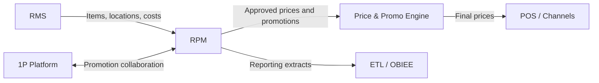
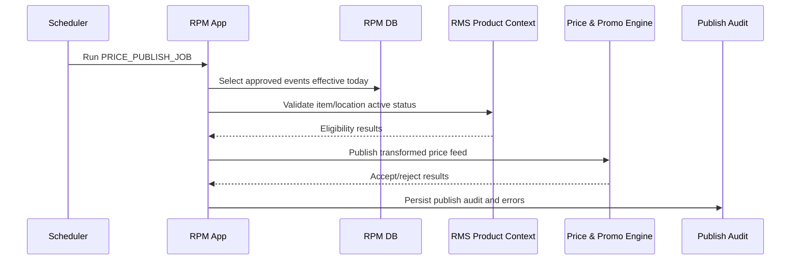

## Purpose

Document Oracle RPM integration contracts, legacy endpoints, and runtime jobs/execution flows in one consolidated runtime document.

# Integration and Execution — Oracle RPM

## Integration Catalogue

| Integration ID | Source | Target | Type | Direction | Capability | Data / Payload | Frequency | Protocol | Owner | Failure Handling | Status | Complexity |
|---|---|---|---|---|---|---|---|---|---|---|---|---|
| RPM-INT-001 | RMS | RPM | Batch/API | Inbound | Item and location context | Item, location, cost, status | Scheduled / near real-time | Oracle SOA | RMS/RPM | Reconciliation report | Active | High |
| RPM-INT-002 | RPM | Price & Promo Engine | Batch/API/event | Outbound | Approved price/promotion publish | Price event, promotion, zone, item | Scheduled/effective date | Oracle SOA | Pricing | Retry queue | Active | High |
| RPM-INT-003 | 1P Platform | RPM | API | Bidirectional | Promotion collaboration | Promotion details, offers | Near real-time | API/MuleSoft | 1P/Pricing | Error response/retry | Active | Medium |
| RPM-INT-004 | RPM | ETL/OBIEE | Batch | Outbound | Pricing reporting | Price event, approval, promotion | Nightly | ETL | Reporting | Batch rerun | Active | Medium |

## Integration dependency diagram

## Endpoint / Service Catalogue

| Endpoint / Interface | Type | Capability | Request/Input | Response/Output | Tables touched | Dependencies | Status | Complexity |
|---|---|---|---|---|---|---|---|---|
| `PRICE_EVENT_SAVE_PROC` | Stored procedure | Create/update price event | Item, zone, price, dates | Price event ID/status | `PRICE_EVENT`, `PRICE_EVENT_ITEM` | RMS item/location context | Active | High |
| `PRICE_APPROVE_PROC` | Stored procedure | Approve price event | Price event ID, approver | Approved/rejected status | `PRICE_APPROVAL`, `PRICE_EVENT` | Approval rules | Active | Medium |
| `PRICE_PUBLISH_JOB` | Batch | Publish approved prices | Approved events by effective date | Price feed | `PRICE_EVENT`, `PRICE_EVENT_ITEM` | Price Engine | Active | High |
| `PROMO_SAVE_PROC` | Stored procedure | Create promotion | Promo details, items, reward | Promotion ID/status | `PROMOTION`, `PROMO_COMPONENT` | RMS item context | Active | High |
| `PROMO_PUBLISH_JOB` | Batch | Publish promotions | Approved promotions | Promotion feed | `PROMOTION`, `PROMO_ITEM` | 1P, Price Engine | Active | High |

## Jobs and Execution Flows

### Job catalogue

| Job ID | Job Name | Schedule | Trigger | Input | Processing Logic | Output | Dependencies | Failure / Retry | Last Run | Status |
|---|---|---|---|---|---|---|---|---|---|---|
| RPM-JOB-001 | `PRICE_PUBLISH_JOB` | Intra-day / nightly | Approved price events effective today | `PRICE_EVENT`, `PRICE_EVENT_ITEM` | Validate, transform and publish prices | Price feed to Price Engine | RMS item context | Retry from failed batch | Sample current | Active |
| RPM-JOB-002 | `PROMO_PUBLISH_JOB` | Intra-day / nightly | Approved promotions | `PROMOTION`, `PROMO_ITEM` | Publish promotions | Promotion feed to 1P/Price Engine | RMS item context | Retry queue | Sample current | Active |
| RPM-JOB-003 | `CLEARANCE_ACTIVATION_JOB` | Nightly | Effective clearance events | `CLEARANCE_EVENT` | Activate clearance markdowns | Clearance price feed | Zone data | Batch rerun | Sample current | Active |
| RPM-JOB-004 | `LEGACY_APPROVAL_BATCH` | Unknown/manual | Old approvals | `PRICE_APPROVAL_LEGACY` | Old status update | Approval status | Unknown | Unknown | Unknown | Deprecated |

### Price event publish execution flow

## Modernization note

`PRICE_PUBLISH_JOB` defines a critical outbound contract. A modern pricing service should initially reproduce this contract or use an adapter until downstream consumers migrate.
