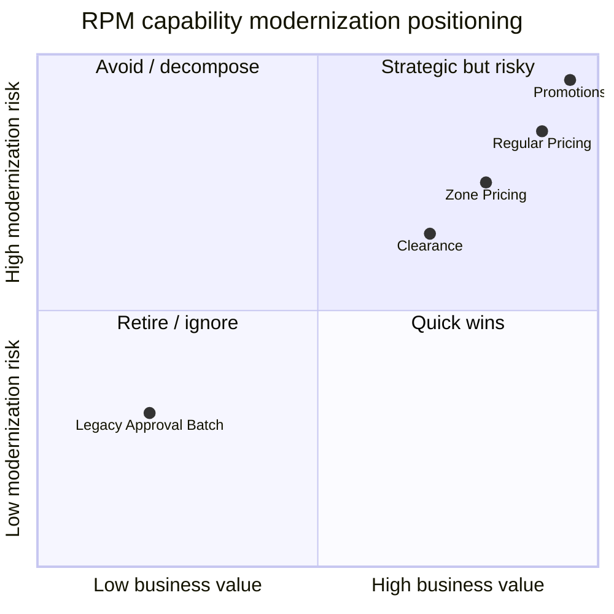

## Purpose

Combine Oracle RPM complexity assessment, thin-slice recommendations, and open questions into a single modernization summary document.

# Modernization Summary — Oracle RPM

## Complexity Heatmap

Scoring: 1 = low, 5 = high.

| Capability | Business Criticality | Usage | Code Complexity | Data Complexity | Integration Coupling | Rule Complexity | Change Risk | Modernization Difficulty | Score | Recommendation |
|---|---:|---|---|---|---|---|---|---:|---:|---|
| Regular Price Events | 5 | 5 | 4 | 4 | 5 | 4 | 5 | 5 | 37 | Strong candidate but needs product context first |
| Promotions | 5 | 5 | 5 | 5 | 5 | 5 | 5 | 5 | 40 | Decompose; not ideal first slice |
| Clearance | 4 | 4 | 3 | 3 | 4 | 3 | 4 | 4 | 29 | Possible after regular pricing |
| Zone Pricing | 5 | 4 | 3 | 4 | 4 | 4 | 5 | 4 | 33 | Build as reference/read model early |
| Legacy Approval Batch | 2 | 1 | 3 | 2 | 1 | 2 | 2 | 2 | 15 | Candidate non-rebuild |

## Mermaid heatmap view

## Thin-Slice Recommendations

### Candidate 1: Price Zone Read Model/API

| Factor | Assessment |
|---|---|
| Capability | Expose read model for price zones and location mapping |
| Business value | Medium — enables pricing validation and simplifies price-event modernization |
| Technical feasibility | Medium |
| Data migration complexity | Low |
| Integration complexity | Medium |
| Risk | Controlled if built as read-only reference model |
| Recommendation | Proceed after slice 1 |

### Candidate 2: Regular Price Event API behind Adapter

| Factor | Assessment |
|---|---|
| Capability | Create and approve regular price events |
| Business value | High |
| Technical feasibility | Medium |
| Risk | High if product/zone and approval contracts are not stabilized |
| Recommendation | Proceed after dependency readiness |

## Open Questions

| ID | Question | Owner | Priority | Needed for |
|---|---|---|---|---|
| RPM-Q-001 | Which pricing consumers require synchronous versus asynchronous publish contracts? | Technical SME | High | Integration strategy |
| RPM-Q-002 | Which promotion overlap rules are most commonly used? | Pricing SME | High | Rule decomposition |
| RPM-Q-003 | Is the legacy approval batch still active for any workflow exceptions? | Support SME | Medium | Retirement decision |
| RPM-Q-004 | Which item/location attributes are required for zone eligibility? | Merchandising/RPM SME | High | Product-zone contract |
