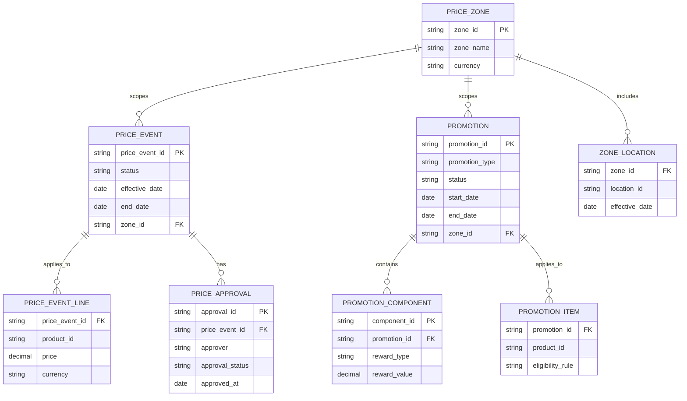

## Purpose
Define the target data model for the Pricing & Promotions domain to support the modern service boundary and integration design.

# ER Diagram — Pricing & Promotions Domain

```mermaid
erDiagram
    PRICE_EVENT ||--o{ PRICE_EVENT_LINE : applies_to
    PRICE_EVENT ||--o{ PRICE_APPROVAL : has
    PROMOTION ||--o{ PROMOTION_COMPONENT : contains
    PROMOTION ||--o{ PROMOTION_ITEM : applies_to
    PRICE_ZONE ||--o{ ZONE_LOCATION : includes
    PRICE_ZONE ||--o{ PRICE_EVENT : scopes
    PRICE_ZONE ||--o{ PROMOTION : scopes

    PRICE_EVENT {
        string price_event_id PK
        string status
        date effective_date
        date end_date
        string zone_id FK
    }

    PRICE_EVENT_LINE {
        string price_event_id FK
        string product_id
        decimal price
        string currency
    }

    PROMOTION {
        string promotion_id PK
        string promotion_type
        string status
        date start_date
        date end_date
        string zone_id FK
    }

    PROMOTION_COMPONENT {
        string component_id PK
        string promotion_id FK
        string reward_type
        decimal reward_value
    }

    PROMOTION_ITEM {
        string promotion_id FK
        string product_id
        string eligibility_rule
    }

    PRICE_ZONE {
        string zone_id PK
        string zone_name
        string currency
    }

    ZONE_LOCATION {
        string zone_id FK
        string location_id
        date effective_date
    }

    PRICE_APPROVAL {
        string approval_id PK
        string price_event_id FK
        string approver
        string approval_status
        date approved_at
    }
```
