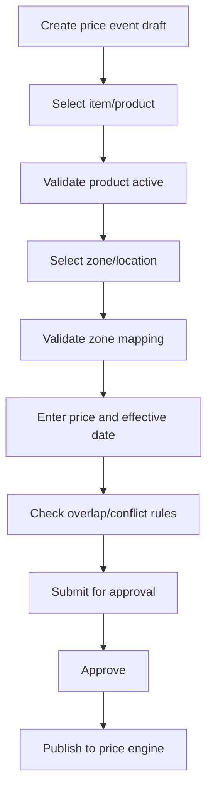

# Functional Spec — Create Regular Price Event

## 1. Purpose

Enable pricing users to create regular price changes for eligible products and locations/zones, route them for approval and publish approved changes to downstream price engines/channels.

## 2. Actors

| Actor | Responsibility |
|---|---|
| Pricing User | Creates price event |
| Pricing Manager | Approves/rejects price event |
| Product Catalogue | Provides product eligibility context |
| Price Engine | Receives approved price feed |

## 3. Main flow

## 4. Exceptions

| Exception | Behaviour |
|---|---|
| Product inactive | Reject or keep draft with error |
| Invalid zone | Reject line |
| Effective date in past | Reject submission |
| Downstream publish failure | Retry and record audit |

## 5. Modernization implication

A modern pricing service requires dependable product and zone read models before replacing RPM write behaviour.
