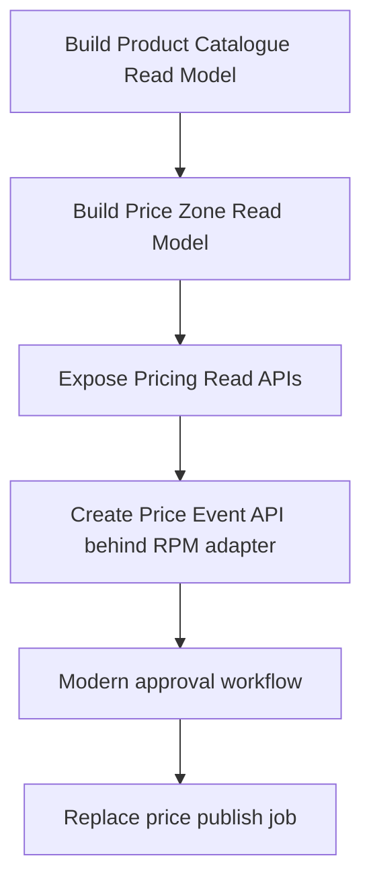

## Purpose
Capture the recommended modernization posture, migration strategy, and sequencing guidance for the Pricing & Promotions target domain.

# Modernization Notes — Pricing & Promotions

## Recommended migration posture

Sequence the migration around dependencies:

## Why not start with Promotions?

Promotions are usually rule-heavy: overlap, eligibility, reward mechanics, precedence, dates, channels and supplier funding. Regular price event flow is a better first write candidate after read-model dependencies are in place.
