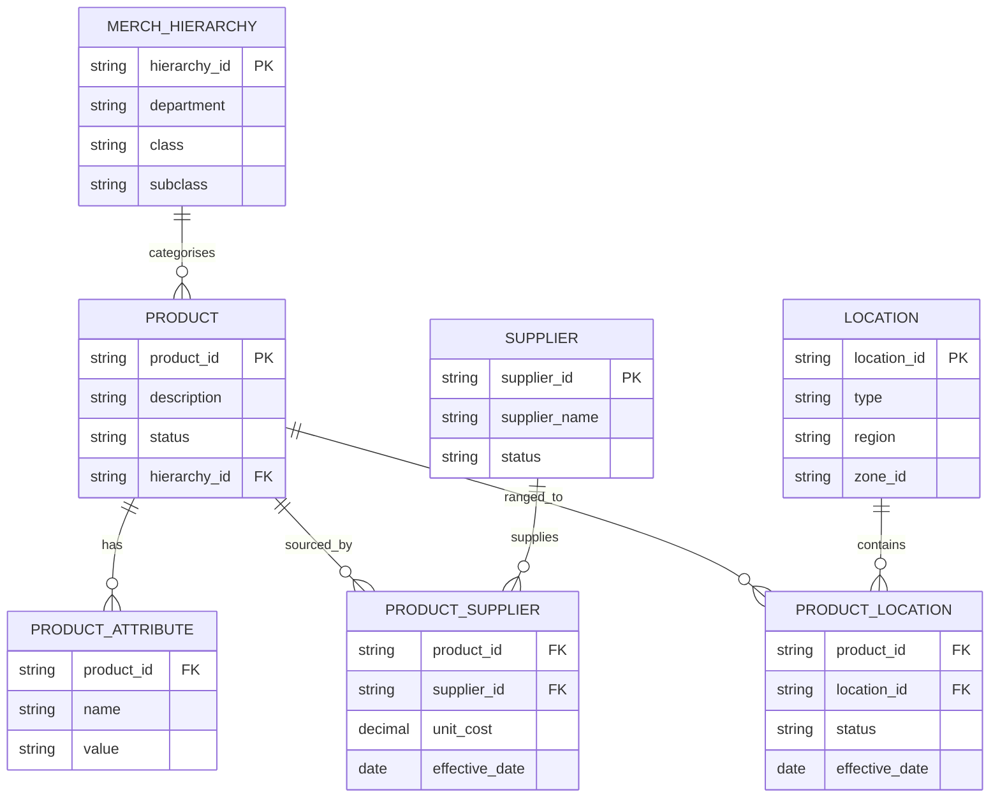

## Purpose
Define the target data model for the Product & Assortment domain to support the modern product service boundary and downstream consumers.

# ER Diagram — Product & Assortment Domain

```mermaid
erDiagram
    PRODUCT ||--o{ PRODUCT_ATTRIBUTE : has
    PRODUCT ||--o{ PRODUCT_SUPPLIER : sourced_by
    SUPPLIER ||--o{ PRODUCT_SUPPLIER : supplies
    PRODUCT ||--o{ PRODUCT_LOCATION : ranged_to
    LOCATION ||--o{ PRODUCT_LOCATION : contains
    MERCH_HIERARCHY ||--o{ PRODUCT : categorises

    PRODUCT {
        string product_id PK
        string description
        string status
        string hierarchy_id FK
    }

    PRODUCT_ATTRIBUTE {
        string product_id FK
        string name
        string value
    }

    SUPPLIER {
        string supplier_id PK
        string supplier_name
        string status
    }

    PRODUCT_SUPPLIER {
        string product_id FK
        string supplier_id FK
        decimal unit_cost
        date effective_date
    }

    LOCATION {
        string location_id PK
        string type
        string region
        string zone_id
    }

    PRODUCT_LOCATION {
        string product_id FK
        string location_id FK
        string status
        date effective_date
    }

    MERCH_HIERARCHY {
        string hierarchy_id PK
        string department
        string class
        string subclass
    }
```
