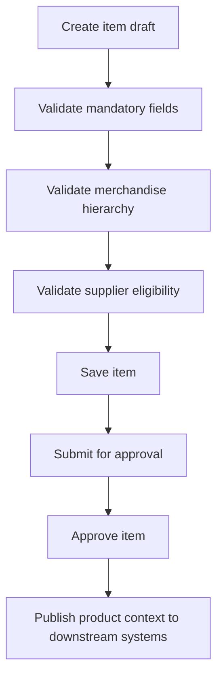

# Functional Spec — Maintain Item Master

## 1. Purpose

Enable merchandising users to create, validate, approve and maintain product/item master data used by pricing, assortment, purchasing and reporting.

## 2. Actors

| Actor | Responsibility |
|---|---|
| Merchandising User | Creates and maintains item details |
| Merchandising Approver | Approves item for downstream usage |
| Pricing System | Consumes active item context |

## 3. Inputs

| Input | Description | Required |
|---|---|---|
| Item description | Product name/description | Yes |
| Merchandise hierarchy | Department/class/subclass | Yes |
| Supplier | Primary or eligible supplier | Usually |
| Item status | Draft/pending/approved/inactive | Yes |
| Attributes | Selling and operational attributes | Depends on category |

## 4. Main flow

## 5. Exceptions

| Exception | Behaviour |
|---|---|
| Invalid hierarchy | Reject save/approval |
| Inactive supplier | Reject supplier assignment |
| Missing mandatory attributes | Keep draft or reject approval |
| Downstream publish failure | Record failure and retry |

## 6. Modernization implication

Start with a read-only product context API before replacing item creation, because item lifecycle rules are likely embedded across UI, DB and batch.
