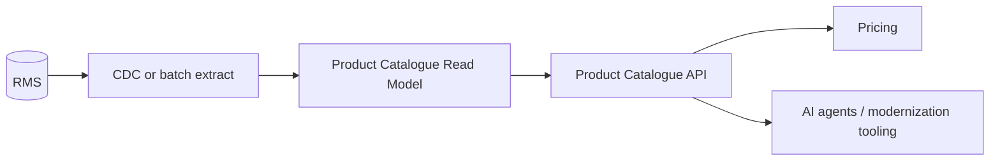

## Purpose
Capture the recommended modernization posture, migration sequence, and target service priorities for Product & Assortment.

# Modernization Notes — Product & Assortment

## Recommended migration posture

Use an **anti-corruption/read-model layer** first:

## Why not start with write replacement?

- Item lifecycle rules may be distributed across UI, database, batch and downstream validation.
- Product data is a dependency for pricing, promotions, assortment and reporting.
- A read model can reduce dependency on RMS without high-risk write migration.

## First target deliverable

A Product Catalogue API that exposes read-only product context for pricing and modernization agents.
