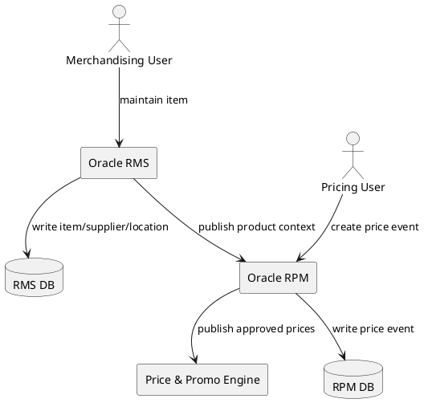

# PlantUML Example — RMS/RPM Context

```plantuml
@startuml
actor "Merchandising User" as Merch
actor "Pricing User" as Pricing
rectangle "Oracle RMS" as RMS
rectangle "Oracle RPM" as RPM
rectangle "Price & Promo Engine" as Engine
database "RMS DB" as RMSDB
database "RPM DB" as RPMDB

Merch --> RMS : maintain item
RMS --> RMSDB : write item/supplier/location
RMS --> RPM : publish product context
Pricing --> RPM : create price event
RPM --> RPMDB : write price event
RPM --> Engine : publish approved prices
@enduml
```
