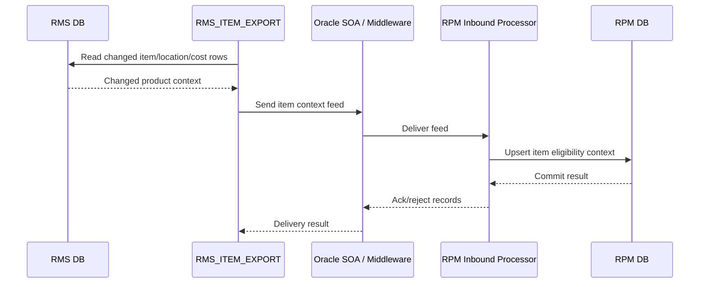

# RMS to RPM Product Context Feed

## Contract fields to validate

| Field | Source | Required by RPM? | Notes |
|---|---|---|---|
| item_id | RMS.ITEM_MASTER | Yes | Product key |
| item_status | RMS.ITEM_MASTER | Yes | Pricing eligibility |
| location_id | RMS.ITEM_LOC | Yes | Zone/location applicability |
| unit_cost | RMS.ITEM_SUPPLIER | Maybe | Margin validation |
| effective_date | RMS item/cost tables | Yes | Price validation |
