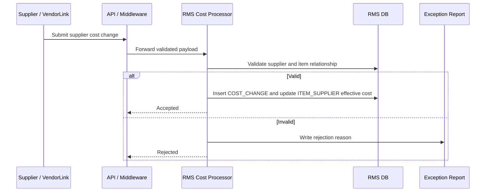

# VendorLink to RMS Cost Change Flow

```mermaid
sequenceDiagram
    participant Vendor as Supplier / VendorLink
    participant Middleware as API / Middleware
    participant RMS as RMS Cost Processor
    participant RMSDB as RMS DB
    participant Report as Exception Report

    Vendor->>Middleware: Submit supplier cost change
    Middleware->>RMS: Forward validated payload
    RMS->>RMSDB: Validate supplier and item relationship
    alt Valid
        RMS->>RMSDB: Insert COST_CHANGE and update ITEM_SUPPLIER effective cost
        RMS-->>Middleware: Accepted
    else Invalid
        RMS->>Report: Write rejection reason
        RMS-->>Middleware: Rejected
    end
```

## Modernization note

This flow can become a Supplier Costing API in target architecture, but only after cost effective-date and overlap rules are validated.
