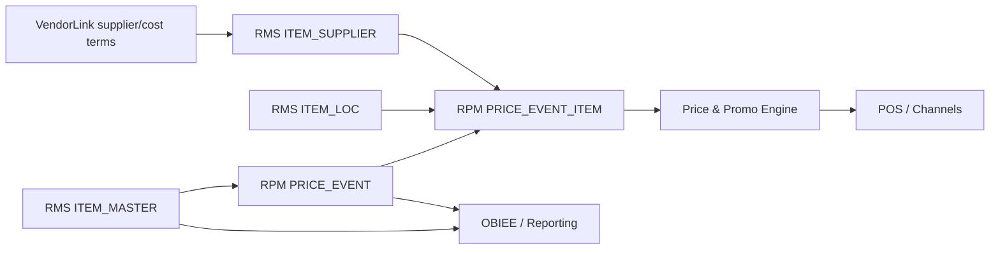

# Data Lineage — Product to Price

## AI interpretation

- Product and cost context flow from RMS into RPM.
- Pricing outputs flow from RPM into downstream price engine and channels.
- Reporting consumes both RMS and RPM, so reporting migration must be planned separately from transactional modernization.
