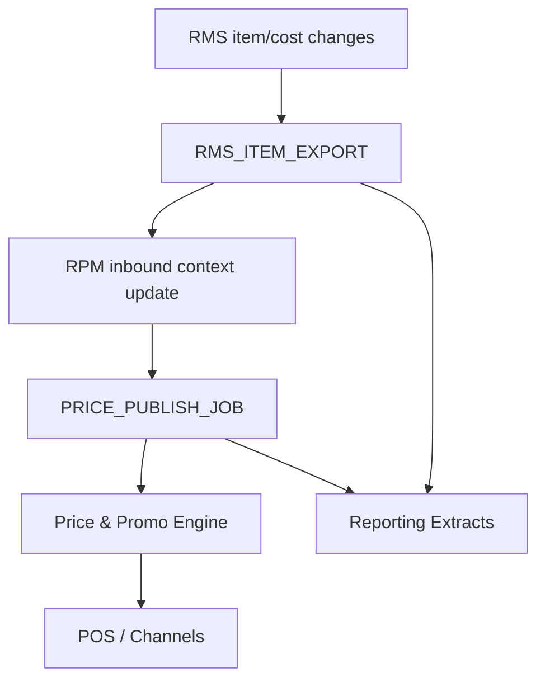

# Batch Scheduler Overview

## Example job groups

| Job Group | System | Purpose | Typical schedule | Risk |
|---|---|---|---|---|
| Product export | RMS | Publish changed item/location context | Hourly/nightly | High impact on RPM |
| Cost sync | RMS | Process supplier cost changes | Daily | Margin/pricing impact |
| Price publish | RPM | Publish approved prices | Intra-day/nightly | High channel impact |
| Promotion publish | RPM | Publish approved promotions | Intra-day/nightly | High customer impact |
| Reporting extracts | RMS/RPM | Feed BI/analytics | Nightly | Legacy DB dependency |

## Scheduler dependency diagram

