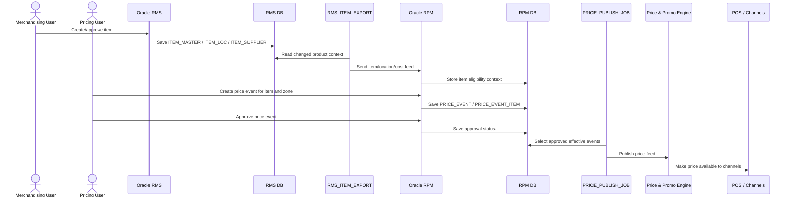

# End-to-End Execution — Item Creation to Price Publication

## Critical modernization seams

| Seam | Why important |
|---|---|
| RMS item export | Can be replaced by Product Catalogue read model/event |
| RPM price event save | Candidate future Pricing API |
| RPM price publish | Needs adapter until downstream consumers migrate |
