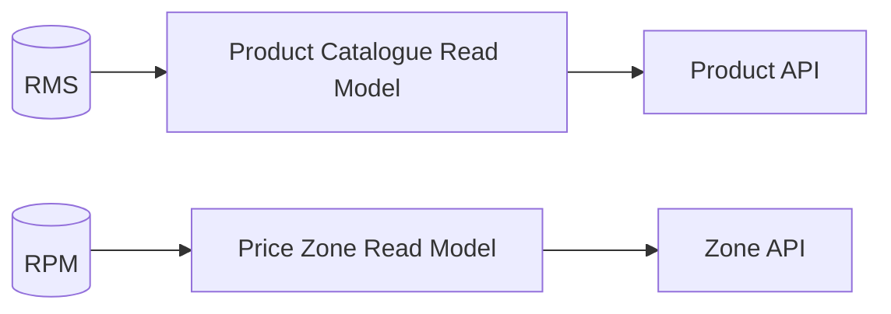
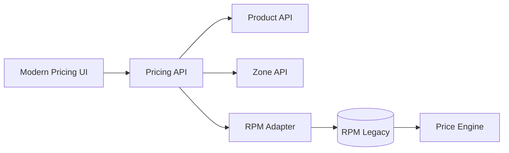

# Modernization Roadmap — Example

## Phase 0 — Context readiness

| Activity | Output |
|---|---|
| Validate used/unused modules | Evidence-backed usage classification |
| Validate product and pricing rules | Accepted business rules catalogue |
| Confirm data ownership | Data ownership matrix |
| Confirm integration contracts | Integration catalogue and sequence diagrams |

## Phase 1 — Read-model enablement

## Phase 2 — Pricing write strangler

## Phase 3 — Contract replacement

Replace legacy publish jobs and direct table dependencies with versioned APIs/events only after consumers are migrated.
