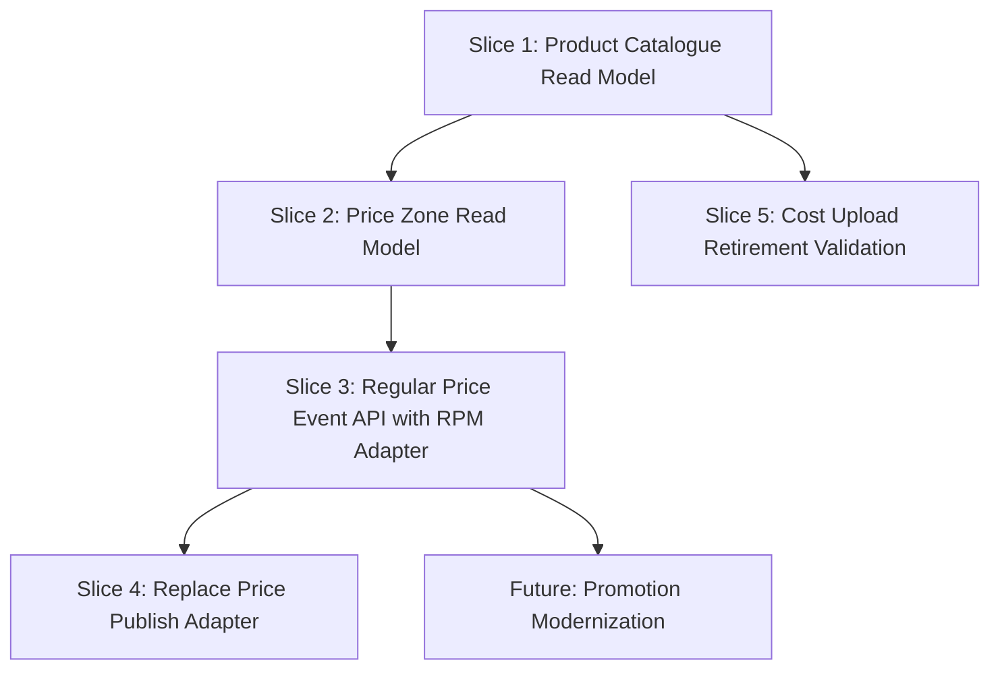

# Cross-System Thin-Slice Recommendations

## Recommended sequence

| Rank | Thin slice | Systems touched | Why this first/next | Risk | Recommendation |
|---:|---|---|---|---|---|
| 1 | Product Catalogue Read Model/API | RMS → consumers | Enables AI agents and downstream modernization without replacing RMS writes | Medium | Proceed |
| 2 | Price Zone Read Model/API | RPM | Enables pricing validation and simplifies price-event modernization | Medium | Proceed after slice 1 |
| 3 | Regular Price Event API behind RPM adapter | RPM, Product API, Zone API | High business value and clear bounded context | High | Proceed after dependency readiness |
| 4 | Legacy cost upload retirement | RMS | Avoid rebuilding dormant process | Low/Medium | Validate and retire |
| 5 | Promotion modernization | RPM, 1P, Engine | High value but high rule complexity | Very High | Defer until rules validated |

## Thin-slice dependency diagram

